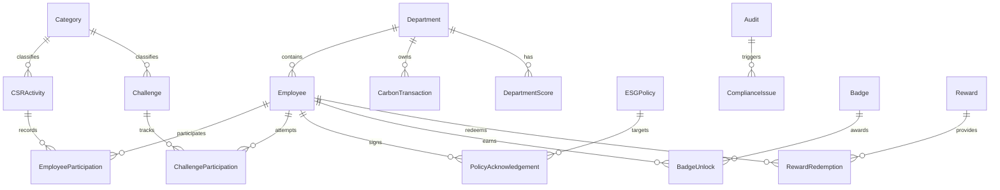

# EcoSphere ESG Platform - Tech Stack & Architecture

This document describes the tech stack, database schemas, modular architecture, and the agentic workflow subdivision to build the EcoSphere ESG Management Platform backend within 8 hours.

---

## 1. Selected Tech Stack

We use a modern, lightweight, type-safe, and highly performant Python stack to minimize setup overhead and maximize velocity:

*   **Language:** Python 3.10+
*   **Web Framework:** **FastAPI**
    *   *Why:* Asynchronous support, extremely rapid development, automatically generated interactive Swagger documentation (`/docs`), and robust request/response validation.
*   **ORM & Data Modeling:** **SQLModel** (SQLAlchemy + Pydantic)
    *   *Why:* Built by the creator of FastAPI. It allows using the exact same classes for Pydantic models (data validation and API docs) and SQLAlchemy models (database table definition). This cuts code duplication by 50%.
*   **Database:** **SQLite** (for local speed/hackathon prototyping) / **PostgreSQL** (production ready)
    *   *Why:* Zero-configuration SQLite database file is perfect for parallel developer runs and instant spin-up. SQLModel allows changing the database to PostgreSQL with a single configuration line change.
*   **Database Migrations:** **Alembic** (optional but scaffolded)
*   **Package Management:** Standard `requirements.txt` (for widest compatibility across different AI agents)

---

## 2. Directory Structure (Feature-Based / Screaming Architecture)

To allow **multiple developer agents to work concurrently without merge conflicts**, we structure the backend into self-contained feature modules under `app/modules/`.

```
backend/
├── app/
│   ├── __init__.py
│   ├── main.py              # Application entrypoint & Router registrations
│   ├── config.py            # Configuration settings (environment variables)
│   ├── database.py          # SQLite engine and session factory
│   └── modules/
│       ├── __init__.py
│       ├── auth/            # Employee Authentication, Profiles & Roles
│       │   ├── __init__.py
│       │   ├── models.py
│       │   ├── router.py
│       │   └── service.py
│       ├── environmental/   # Emission factors, Carbon transactions, ESG profiles, Goals
│       │   ├── __init__.py
│       │   ├── models.py
│       │   ├── router.py
│       │   └── service.py
│       ├── social/          # CSR activities, Employee participation, Diversity metrics
│       │   ├── __init__.py
│       │   ├── models.py
│       │   ├── router.py
│       │   └── service.py
│       ├── governance/      # ESG Policies, Audits, Compliance issues
│       │   ├── __init__.py
│       │   ├── models.py
│       │   ├── router.py
│       │   └── service.py
│       ├── gamification/    # Challenges, Badges, XP, Rewards, Leaderboards
│       │   ├── __init__.py
│       │   ├── models.py
│       │   ├── router.py
│       │   └── service.py
│       ├── settings/        # Global ESG Configurations & Notifications toggles
│       │   ├── __init__.py
│       │   ├── models.py
│       │   ├── router.py
│       │   └── service.py
│       └── reports/         # ESG Summary, Custom reports generator
│           ├── __init__.py
│           ├── models.py
│           ├── router.py
│           └── service.py
├── requirements.txt
└── README.md
```

---

## 3. Detailed Data Models

Below is the design of the database models using **SQLModel** syntax to represent our schema relationships.



### Master Data Entities

1.  **Department** (`app.modules.auth.models.Department`)
    *   `id`: int (PK)
    *   `name`: str
    *   `code`: str (Unique)
    *   `head`: str (Department Head)
    *   `parent_department_id`: int (Self-referential FK)
    *   `employee_count`: int
    *   `status`: str (Active / Inactive)
2.  **Category** (`app.modules.settings.models.Category`)
    *   `id`: int (PK)
    *   `name`: str
    *   `type`: str (CSR Activity / Challenge)
    *   `status`: str (Active / Inactive)
3.  **EmissionFactor** (`app.modules.environmental.models.EmissionFactor`)
    *   `id`: int (PK)
    *   `activity_type`: str (e.g., Electricity, Travel, Shipping)
    *   `factor_value`: float (kg CO2 per unit)
    *   `unit`: str (e.g., kWh, km, kg)
    *   `status`: str (Active / Inactive)
4.  **ProductESGProfile** (`app.modules.environmental.models.ProductESGProfile`)
    *   `id`: int (PK)
    *   `product_name`: str
    *   `product_sku`: str (Unique)
    *   `carbon_footprint_kg`: float
    *   `recyclability_percentage`: float
    *   `water_footprint_liters`: float
5.  **EnvironmentalGoal** (`app.modules.environmental.models.EnvironmentalGoal`)
    *   `id`: int (PK)
    *   `title`: str
    *   `target_emission_reduction`: float
    *   `target_date`: date
    *   `current_progress`: float
    *   `status`: str (Active / Met / Missed)
6.  **ESGPolicy** (`app.modules.governance.models.ESGPolicy`)
    *   `id`: int (PK)
    *   `title`: str
    *   `description`: str
    *   `version`: str
    *   `effective_date`: date
    *   `status`: str (Draft / Active / Retired)
7.  **Badge** (`app.modules.gamification.models.Badge`)
    *   `id`: int (PK)
    *   `name`: str
    *   `description`: str
    *   `unlock_rule`: str (JSON mapping: e.g., `{"metric": "xp", "value": 500}` or `{"metric": "challenges", "value": 5}`)
    *   `icon`: str (URL / Asset Path)
8.  **Reward** (`app.modules.gamification.models.Reward`)
    *   `id`: int (PK)
    *   `name`: str
    *   `description`: str
    *   `points_required`: int
    *   `stock`: int
    *   `status`: str (Active / Inactive)

### Transactional Data Entities

1.  **Employee** (`app.modules.auth.models.Employee`)
    *   `id`: int (PK)
    *   `name`: str
    *   `email`: str (Unique)
    *   `password_hash`: str
    *   `role`: str (Admin / ESG Manager / Employee)
    *   `department_id`: int (FK -> Department)
    *   `xp_points`: int (Default: 0)
    *   `redeemable_points`: int (Default: 0)
2.  **CarbonTransaction** (`app.modules.environmental.models.CarbonTransaction`)
    *   `id`: int (PK)
    *   `source_type`: str (Purchase / Manufacturing / Expense / Fleet)
    *   `source_id`: str (Reference to Odoo / external ERP record ID)
    *   `raw_value`: float (e.g. 500 km or 1200 kWh)
    *   `emission_factor_id`: int (FK -> EmissionFactor)
    *   `calculated_emissions_kg`: float
    *   `transaction_date`: date
    *   `department_id`: int (FK -> Department)
3.  **CSRActivity** (`app.modules.social.models.CSRActivity`)
    *   `id`: int (PK)
    *   `title`: str
    *   `description`: str
    *   `category_id`: int (FK -> Category)
    *   `date`: date
    *   `points_reward`: int
    *   `max_participants`: int
    *   `status`: str (Upcoming / Completed / Cancelled)
4.  **EmployeeParticipation** (`app.modules.social.models.EmployeeParticipation`)
    *   `id`: int (PK)
    *   `employee_id`: int (FK -> Employee)
    *   `activity_id`: int (FK -> CSRActivity)
    *   `proof_file_url`: str (Optional, required if Evidence Requirement toggle is enabled)
    *   `approval_status`: str (Pending / Approved / Rejected)
    *   `points_earned`: int
    *   `completion_date`: date
5.  **Challenge** (`app.modules.gamification.models.Challenge`)
    *   `id`: int (PK)
    *   `title`: str
    *   `category_id`: int (FK -> Category)
    *   `description`: str
    *   `xp`: int
    *   `difficulty`: str (Easy / Medium / Hard)
    *   `evidence_required`: bool
    *   `deadline`: datetime
    *   `status`: str (Draft / Active / Under Review / Completed / Archived)
6.  **ChallengeParticipation** (`app.modules.gamification.models.ChallengeParticipation`)
    *   `id`: int (PK)
    *   `challenge_id`: int (FK -> Challenge)
    *   `employee_id`: int (FK -> Employee)
    *   `progress`: float (Percentage 0-100)
    *   `proof_file_url`: str
    *   `approval_status`: str (Pending / Approved / Rejected)
    *   `xp_awarded`: int
    *   `status`: str (Joined / Completed)
7.  **PolicyAcknowledgement** (`app.modules.governance.models.PolicyAcknowledgement`)
    *   `id`: int (PK)
    *   `employee_id`: int (FK -> Employee)
    *   `policy_id`: int (FK -> ESGPolicy)
    *   `acknowledged_at`: datetime
8.  **Audit** (`app.modules.governance.models.Audit`)
    *   `id`: int (PK)
    *   `title`: str
    *   `auditor`: str
    *   `audit_date`: date
    *   `score`: float
    *   `status`: str (Scheduled / In Progress / Completed)
9.  **ComplianceIssue** (`app.modules.governance.models.ComplianceIssue`)
    *   `id`: int (PK)
    *   `audit_id`: int (FK -> Audit, Optional)
    *   `title`: str
    *   `description`: str
    *   `severity`: str (Low / Medium / High / Critical)
    *   `owner_id`: int (FK -> Employee)
    *   `due_date`: date
    *   `status`: str (Open / Resolved / Overdue)
10. **DepartmentScore** (`app.modules.settings.models.DepartmentScore`)
    *   `id`: int (PK)
    *   `department_id`: int (FK -> Department)
    *   `environmental_score`: float
    *   `social_score`: float
    *   `governance_score`: float
    *   `total_score`: float
    *   `calculation_date`: date

---

## 5. Work Division & Instructions for Parallel Agent Workflows

The following details the API endpoints and logic to be built by each autonomous agent workflow:

### Workflow 1: Core Base & Authentication (Agent A)
*   **Target Files:** `backend/app/main.py`, `backend/app/database.py`, `backend/app/config.py`, `backend/app/modules/auth/`
*   **Key APIs:**
    *   `POST /auth/register` (Register Employee / Admin)
    *   `POST /auth/login` (Returns JWT access token)
    *   `GET /auth/me` (Returns current user details)
    *   `CRUD /departments` (Admin management of departments)
*   **Core Logic:**
    *   Password hashing (`passlib[bcrypt]`).
    *   Security helper `get_current_user` dependency.
    *   Database engine startup & session pooling.

### Workflow 2: Environmental Module (Agent B)
*   **Target Files:** `backend/app/modules/environmental/`
*   **Key APIs:**
    *   `CRUD /environmental/factors` (Manage emission factors)
    *   `CRUD /environmental/products` (Product profiles)
    *   `CRUD /environmental/goals` (Environmental target goals)
    *   `POST /environmental/transactions` (Log transactional activity: purchase/fleet etc.)
    *   `GET /environmental/dashboard` (Carbon output aggregated by department and time)
*   **Core Logic:**
    *   **Auto Emission Calculation Rule:** If `auto_emission_calculation` setting is enabled, when a transaction is logged, look up the `EmissionFactor` and compute `calculated_emissions_kg = factor_value * raw_value`.

### Workflow 3: Social Module (Agent C)
*   **Target Files:** `backend/app/modules/social/`
*   **Key APIs:**
    *   `CRUD /social/activities` (CSR activity creation and scheduling)
    *   `POST /social/activities/{id}/join` (Employee signs up)
    *   `POST /social/activities/{id}/submit-proof` (Submit proof URL/attachment)
    *   `POST /social/activities/participations/{id}/approve` (Admin updates approval status, awards CSR points to employee)
    *   `GET /social/diversity-metrics` (Aggregate stats on employee counts, gender ratio, department dispersion)
*   **Core Logic:**
    *   **Evidence Requirement Rule:** If `evidence_requirement` toggle is enabled under settings, blocking approval if `proof_file_url` is null.

### Workflow 4: Governance Module (Agent D)
*   **Target Files:** `backend/app/modules/governance/`
*   **Key APIs:**
    *   `CRUD /governance/policies` (Manage policy documents)
    *   `POST /governance/policies/{id}/acknowledge` (Accept policy)
    *   `CRUD /governance/audits` (Log and review audit parameters)
    *   `CRUD /governance/issues` (Log compliance concerns)
*   **Core Logic:**
    *   **Compliance Issue Ownership:** Every issue requires an owner and due date. A background check or endpoint scan must mark Open issues as "Overdue" when system date passes the due date. Send an alert/notification record if marked overdue.

### Workflow 5: Gamification Module (Agent E)
*   **Target Files:** `backend/app/modules/gamification/`
*   **Key APIs:**
    *   `CRUD /gamification/challenges` (Lifecycle: Draft -> Active -> Under Review -> Completed / Archived)
    *   `POST /gamification/challenges/{id}/participate` (Join a challenge)
    *   `POST /gamification/challenges/{id}/submit-evidence` (Progress/Proof)
    *   `POST /gamification/challenges/participations/{id}/approve` (Award XP)
    *   `POST /gamification/rewards/{id}/redeem` (Employee buys reward)
    *   `GET /gamification/leaderboard` (Individual XP leaderboards & Department scores leaderboards)
*   **Core Logic:**
    *   **Reward Redemption:** Deduct `points_required` from employee's `redeemable_points` if stock > 0. Decrement reward stock.
    *   **Badge Auto-Award:** Check `badge_auto_award` setting. When XP or challenge completions update, check if unlock rules (e.g. `{"metric": "xp", "value": 500}`) are satisfied. Auto-create user's Badge relation.

### Workflow 6: Settings, Notifications & Reports (Agent F)
*   **Target Files:** `backend/app/modules/settings/`, `backend/backend/app/modules/reports/`
*   **Key APIs:**
    *   `GET/PATCH /settings/config` (System configuration toggles & weights)
    *   `GET /notifications` (Retrieve user's in-app alerts)
    *   `GET /reports/environmental` (Export filters PDF/CSV)
    *   `GET /reports/social`
    *   `GET /reports/governance`
    *   `GET /reports/summary` (ESG Overall Report)
*   **Core Logic:**
    *   **ESG Summary Score Formula:** Overall score = weighted average of all department total scores.
        *   `Total Department Score = (Environmental Score * EnvWeight) + (Social Score * SocWeight) + (Governance Score * GovWeight)`
        *   Default weight configurations: Env 40% / Social 30% / Governance 30%.
    *   **Notification Engine:** Function utility to log in-app/email alerts (compliance issues, badge awards, approvals).
